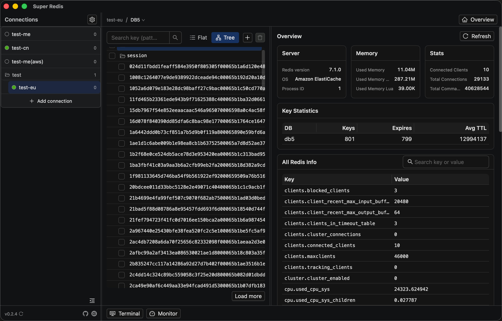
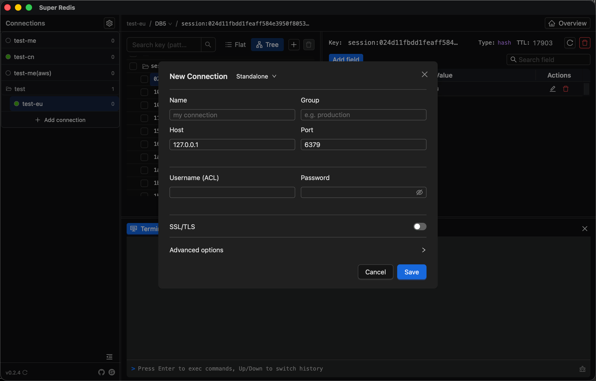
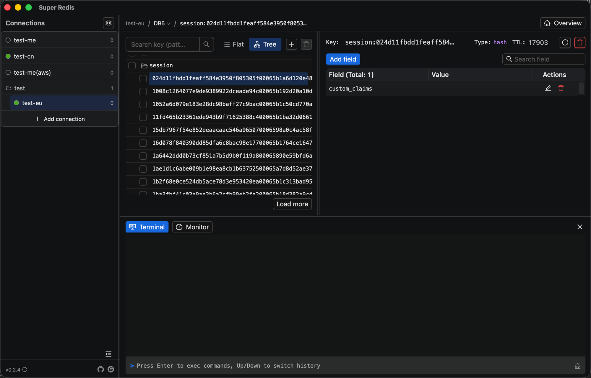
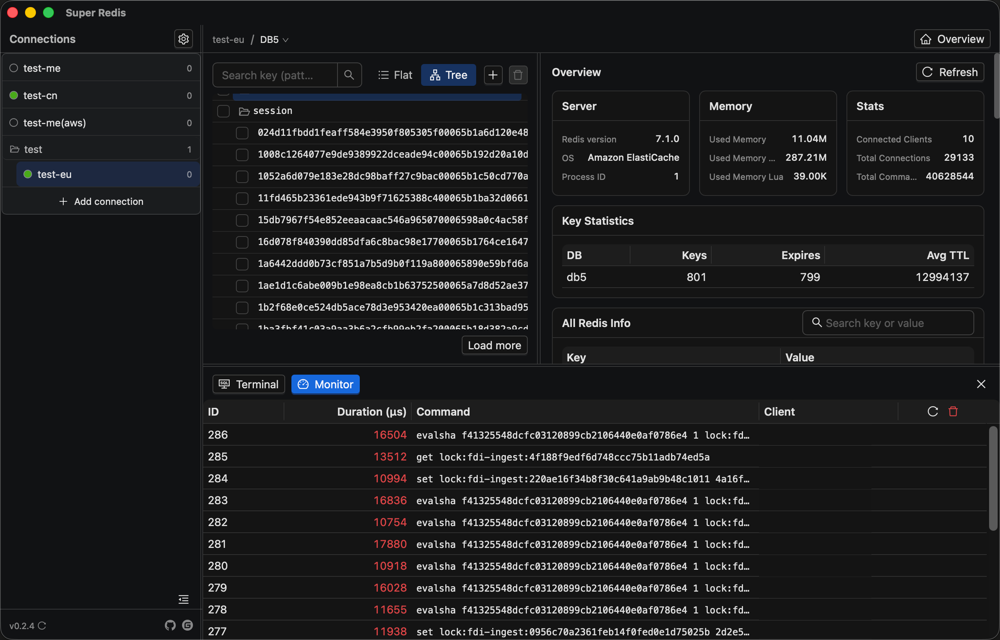

[English](README.md) | [简体中文](README.zh-CN.md)

# Super Redis Desktop

一款基于 [Tauri 2](https://v2.tauri.app/) + Rust + React 的跨平台 Redis 桌面客户端，功能参考 [AnotherRedisDesktopManager](https://gitee.com/qishibo/AnotherRedisDesktopManager)。开箱即用，无需部署。

**仓库**: [GitHub](https://github.com/Jacksonary/super-redis) | [Gitee](https://gitee.com/weiguoliu/super-redis)

## 界面预览

| 主界面 | 新建连接 |
|--------|----------|
|  |  |

| Hash 值查看 | 命令监控 |
|-------------|----------|
|  |  |

## 功能

### 连接管理
- 连接数量不限，支持彩色标签、分组（拖拽移动）、克隆、一键测试连接
- 每个连接带实时健康状态圆点（正常 / 异常 / 未连接）
- 单机 / Redis Cluster / Redis Sentinel 三种模式
- SSL/TLS（rediss），支持 CA、客户端证书（mTLS）、SNI、跳过校验
- ACL 用户名密码（Redis 6+）与可配置超时
- 只读模式 —— 界面所有写操作禁用，终端拦截危险命令
- 库切换器，显示各库 key 数量

### Key 浏览与管理
- 基于 SCAN 的分页浏览，绝不阻塞服务端（不使用 KEYS）
- 模式搜索（SCAN MATCH）
- 扁平列表与树形视图（按可配置的 key 分隔符分组，文件夹可折叠）
- 新建 Key（string / hash / list / set / zset），可指定 TTL
- 重命名、设置过期 / 持久化、复制 key 名
- 勾选批量删除，或按 pattern 删除整个文件夹
- UNLINK 异步删除，删除大 value 不阻塞
- 按需查看 Key 元信息：类型、TTL、内存占用、编码

### 值查看与编辑
- **String** —— 在线编辑，格式转换（text / JSON / hex / base64 / gzip / deflate / brotli / msgpack），JSON 自动格式化，二进制自动识别
- **Hash** —— 分页字段/值表格，新增、编辑、删除、字段重命名，精确或模糊搜索
- **List** —— 分页浏览，LPUSH/RPUSH、按索引编辑、按值或索引删除、LPOS 搜索
- **Set** —— 分页成员列表，添加、删除、重命名，成员判断与模糊搜索
- **ZSet** —— 分页成员列表，添加、修改 score、删除、重命名、搜索
- **Stream** —— 消息条目、XADD / XDEL、创建消费组、XINFO GROUPS

### 监控
- **总览** —— 服务端 / 内存 / 统计卡片、各库 key 数量、可搜索的 INFO 全量信息
- **慢日志** —— SLOWLOG GET，按耗时着色，支持重置
- **内存分析** —— MEMORY USAGE 采样后按大小倒序，快速定位大 key
- **客户端** —— CLIENT LIST，高亮自身连接，支持 KILL 单个客户端
- **命令统计** —— 调用次数、总耗时、单次均耗时、失败次数
- **延迟统计** —— LATENCY LATEST

### 终端
- 命令控制台，正确解析引号，支持 ↑/↓ 翻历史
- 阻塞命令（SUBSCRIBE / MONITOR / BLPOP / XREAD…）会被拦截并给出明确提示
- 危险命令识别，只读模式下强制拦截

### 设置
- 浅色 / 暗色主题
- 可配置 key 分隔符、SCAN 批量大小与操作间隔
- 连接配置导入 / 导出（JSON）
- 单实例 / 多实例模式

### 应用
- 内置更新检查，支持应用内下载与安装
- 侧栏宽度、表格列宽均可拖拽调整

## 下载

前往 [GitHub Releases](https://github.com/Jacksonary/super-redis/releases) 或 [Gitee Releases](https://gitee.com/weiguoliu/super-redis/releases) 下载安装包：

| 平台 | 格式 |
|---|---|
| Windows 64 位 | `.exe` (NSIS) / `.msi` |
| Linux | `.deb` / `.rpm` / `.AppImage` |
| macOS (Apple Silicon) | `.dmg` |

> macOS 版本未做签名/公证，若 Gatekeeper 提示"已损坏"，请移除隔离属性：
> ```bash
> xattr -cr "/Applications/Super Redis.app"
> ```

## 配置

连接配置保存在系统应用数据目录；密码仅存于系统钥匙串：

| 系统 | 路径 |
|---|---|
| macOS | `~/Library/Application Support/super-redis/config.json` |
| Linux | `~/.config/super-redis/config.json` |
| Windows | `%APPDATA%\super-redis\config.json` |

## 从源码构建

```bash
# 前置：Rust、Node.js、Tauri 系统依赖
# Linux: sudo apt install libwebkit2gtk-4.1-dev libjavascriptcoregtk-4.1-dev libsoup-3.0-dev librsvg2-dev libayatana-appindicator3-dev
# Tauri CLI：npm i（devDependencies 内含 @tauri-apps/cli）

git clone https://github.com/Jacksonary/super-redis.git
cd super-redis
npm install
npm run tauri dev
```

构建产物位于 `src-tauri/target/release/bundle/`。

## 技术栈

| 分层 | 技术 |
|---|---|
| 框架 | Tauri 2 |
| 后端 | Rust + redis-rs（async，支持集群/哨兵/TLS） |
| 前端 | React 18 + TypeScript + Ant Design 5 |
| 构建 | Vite 5 + Cargo |

---

## License

[Apache License 2.0](LICENSE)。

## 打赏支持

如果这个项目对你有帮助，欢迎请作者喝瓶啤酒 🍺

<p align="center">
  <table align="center"><tr>
    <td align="center">
      <br>微信
    </td>
    <td width="60"></td>
    <td align="center">
      <br>支付宝
    </td>
  </tr></table>
</p>
